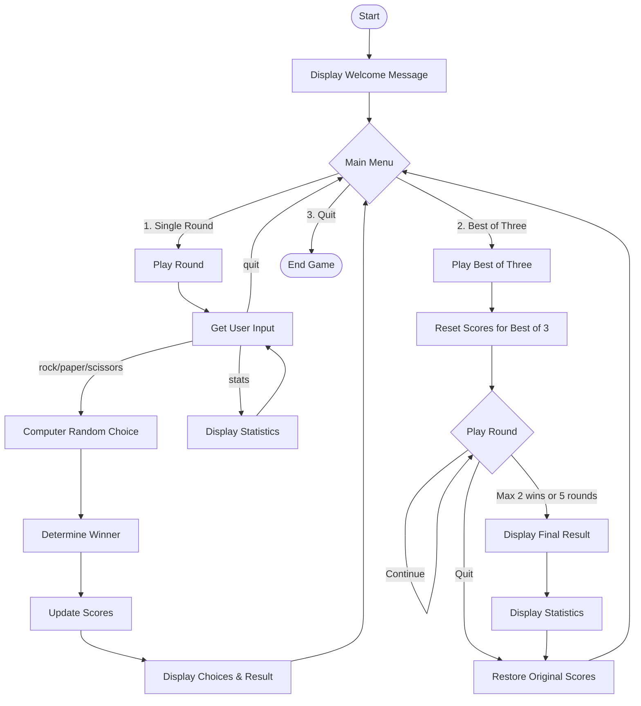

# Rock Paper Scissors Game

[](https://python.org)
[](LICENSE)

 

A colourful, terminal-based Rock Paper scissoirs game with statistics tracking and best-of-three mode.

### Features
- 🎨 Colorful ASCII art for each choice (rock, paper, scissors)
- 📊 Statistics tracking (wins, losses, ties, rounds played)
- 🏆 Best-of-three competitive mode
- 📝 Command-based interface with helpful prompts
- 🎮 Simple menu system for easy navigation

### How to Play
1. Run the game by executing game.py with Python 3
2. Follow the on-screen instructions:
    - Type rock, paper, or scissors to make your choice
    - Type stats to view current game statistics
    - Type best to enter best-of-three mode
    - Type quit to exit the game
  

### Game rules
- ✊ Rock crushes ✌️ Scissors
- ✌️ Scissors cut ✋ Paper
- ✋ Paper covers ✊ Rock

### Requirements
- Python 3.x
- `colorama` package (install with `pip install colorama`)


### Installation
1. Clone this repository or download the `game.py` file
2. Install dependencies:
   ```bash
   pip install colorama
   ```
3. Run the game:
   ```bash
   python game.py
   ```

### logic


Enjoy the game! For any issues or feature requests, please open up an issue on GitHub.


